- [why helm (v3)](#why-helm--v3-)
- [chart](#chart)
- [persistency](#persistency)
- [three-way merge patches update](#three-way-merge-patches-update)
- [namespaces](#namespaces)
- [helm installation on win10](#helm-installation-on-win10)
  * [install helm chart](#install-helm-chart)
  * [uninstall helm chart](#uninstall-helm-chart)
  * [helm variables](#helm-variables)
- [building helm charts](#building-helm-charts)
- [helm release and release revision.](#helm-release-and-release-revision)
- [basic commands](#basic-commands)
- [install, upgrade, rollback](#install--upgrade--rollback)
  * [chart1](#chart1)
  * [chart2](#chart2)
  * [rollback to revision 1 of the release](#rollback-to-revision-1-of-the-release)
    + [history](#history)
  * [chart 3](#chart-3)
  * [chart 4 - INGRESS controller](#chart-4---ingress-controller)
- [links](#links)

# why helm (v3)

**Packaging**

> With kubectl you do not install application as atomic set of kubernetes objects. Rather you deploy each object (yaml) separately. Also these objects might have dependencies between each other and order of installation might be important. Helm allows to group all kuberentes objects (yaml files) in one package and install the whole package. kubectl does not support rollbacks but helm supports it.

**Versioning**

> kubectl does not support versioning of kubernets objects

# chart
With helm you install your application as an entity defined by your **chart** and not a set of independent kubernetes objects. Chart is definition of your application.

# persistency

Helm stores release manifests (application versions) inside Kubernetes as secrets.

# three-way merge patches update

What if I modify Kubernetes objects with a tools other then Helm like kubectl. Helm tree compares the three manifests: old chart, new chart, live state. Based on this it creates a patch that merges the updates in best possible way. For example if something has been changed via kubectl and now we want apply a new chart then the change that was done via kubectl will stay as long as there is no conflict with new chart. The same is relvant also for rollbacks!

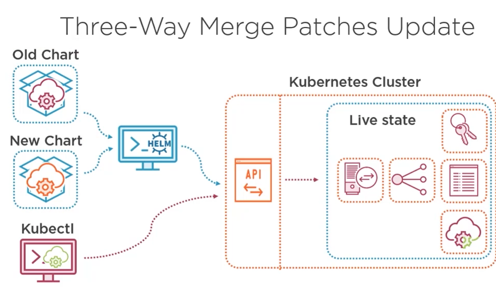

# namespaces

Helm supports namespaces like kubectl.

# helm installation on win10

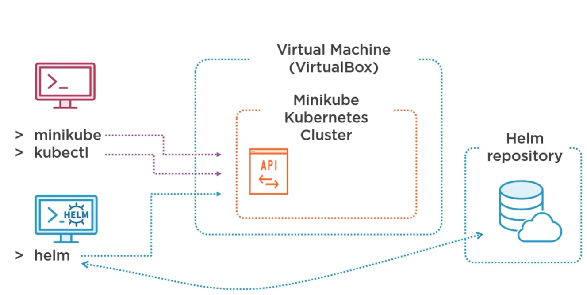
>NOTE: in next steps I used K8s cluster installed together with docker. I did not used VirtualBox.

Run PowerShell as admin and execute:
```
choco install kubernetes-helm
```

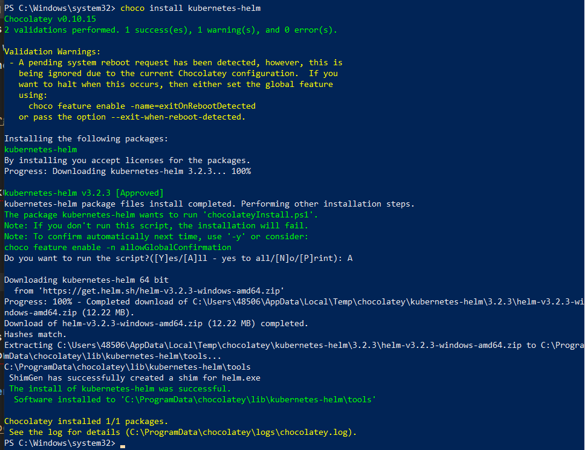

To check version execute:
```
helm version --short
```

>NOTE: helm connection string is configured in the same file that is used by *kubectl* command: %USERPROFILE%\.kube\config

By default helm tree is not configured to use any repository. If you want to install existing packages you have to add keys to repositories containing some charts.
To install official helm repository execute the following command:

```
helm repo add stable https://kubernetes-charts.storage.googleapis.com
```
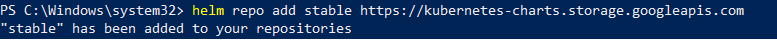

## install helm chart

Next we can install sample chart available in the official repository.

```
helm install demo-mysql stable/mysql
```
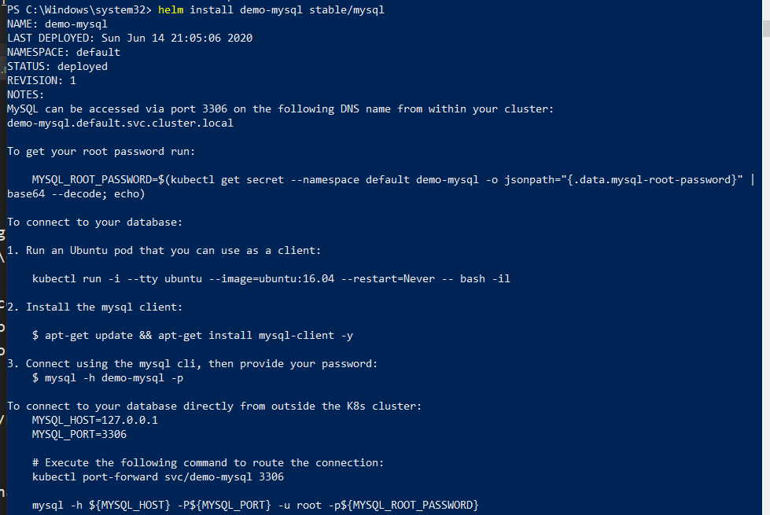
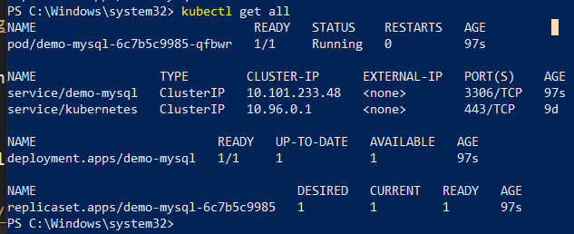

To get password execute command and next use some online page for base64 decode:
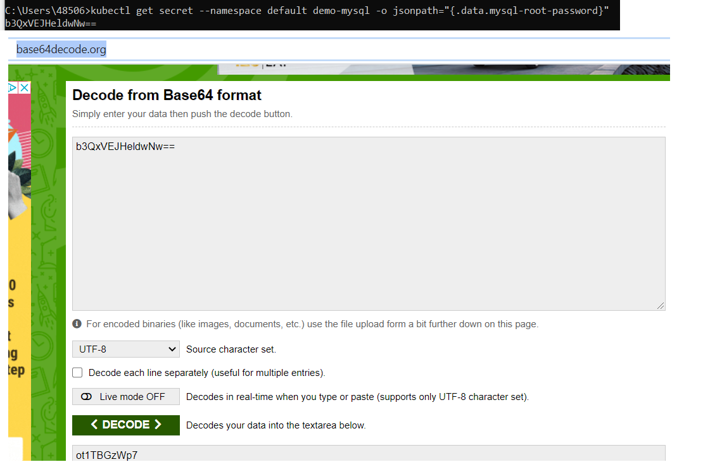
The password is **ot1TBGzWp7**.

Next install mysql client https://dev.mysql.com/downloads/workbench/ and connect to installed by helm mysql.

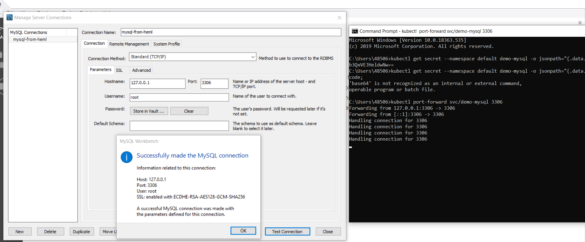
>NOTE: it was mandatory to run port forwarding to be able connect to the mysql!

## uninstall helm chart

```
helm uninstall demo-mysql
```


## helm variables

```
helm env
```

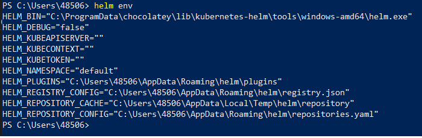

# building helm charts

https://helm.sh/docs/topics/charts/

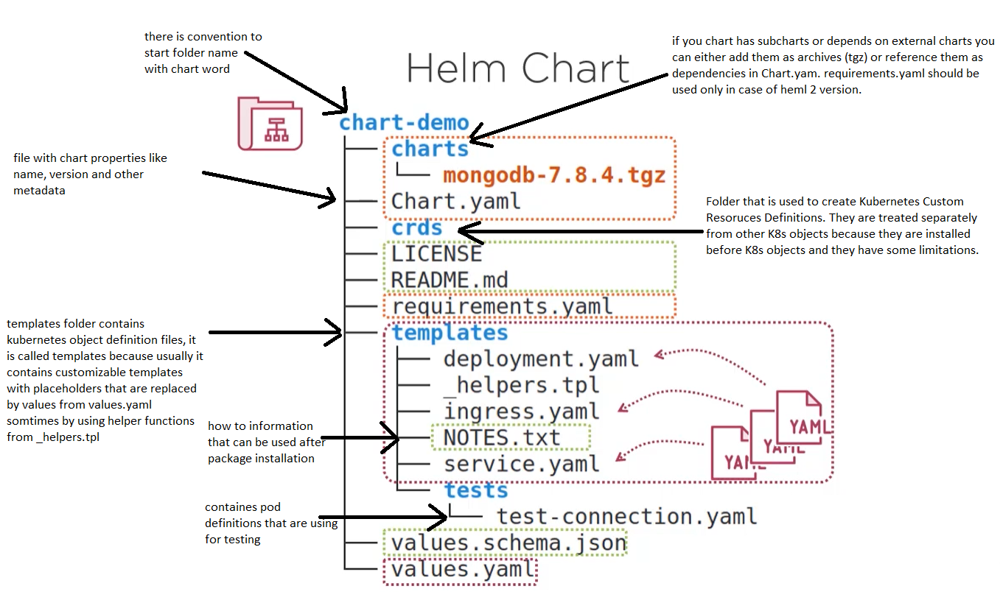


# helm release and release revision.
Helm supports release concept including release the same chart but with different K8s object names, for example: test, pre-prod, prod.   

In case we did a change only in single yaml file that we can update only this file and not do the new whole release - it is called **release revision**.

# basic commands
| Action| Command|
|----------|----------|
| Install a release | helm install [release] [chart] |
| Upgrade to a release revision| helm upgrade [release] [chart] |
| Rollback to a release revision | helm rollback [release] [revision] |
| Print release history | helm history [release] |
| Display release status | helm status [release] |
| Show details of a release | helm get all [release] |
| Uninstall a release | helm uninstall [release] |
| List releases | helm list |

# install, upgrade, rollback

## chart1

[chart1](charts/chart1/chart/guestbook)

We refer to local chart and not chart from official helm repostory.

```
helm install demoguestbook guestbook
helm uninstall demoguestbook
```
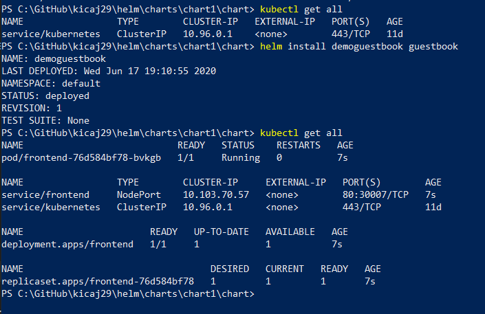

Open in web browser http://localhost:30007/ to see the app.


Next we can use the following command to see release details:

```
helm get manifest demoguestbook
```

## chart2

[chart2](charts/chart2/chart/guestbook)

Here we deploy the same chart but with different application. The change was only in the application and not in the chart.
*appVersion* and *description* from *Chart.yaml* are set to 1.1 but *version* of the chart stays the same 0.1.0.   
In *frontend.yaml* we refer to new image *phico/frontend:1.1*.

```
helm upgrade demoguestbook guestbook
```

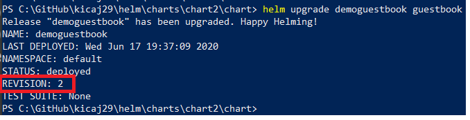

## rollback to revision 1 of the release

```
helm rollback demoguestbook 1
```

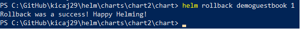

### history

```
helm history demoguestbook
```

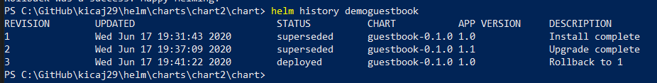

## chart 3

Chart 3 contains classic example with front-end, back-end and database.

[chart3](charts/chart3/chart/guestbook)

chart 3 adds back-end and database.

*version* field in main *Chart.yaml* is updated to 1.1.0 because there are changes in infrastructure.

```
helm upgrade demoguestbook guestbook
```
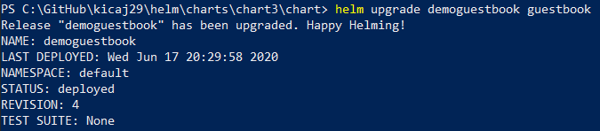

Next we can check status and history:

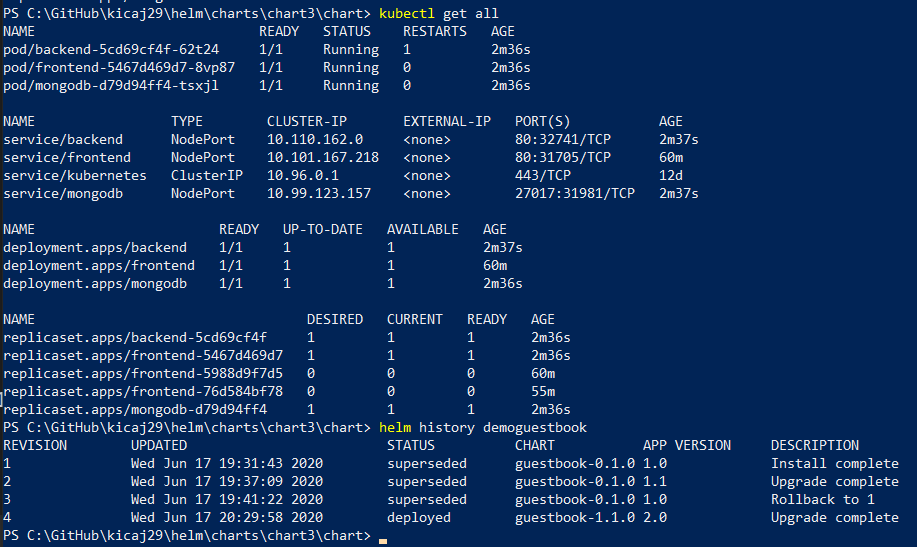

and we can open the new app: http://localhost:31705

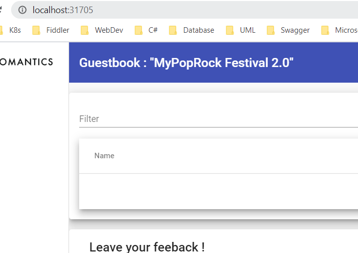

## chart 4 - INGRESS controller

>NOTE: before we start we have to install previous release because upgrade is not possible.

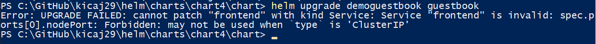

[chart4](charts/chart4/chart/guestbook)

First we have to install ingress controller
https://kubernetes.github.io/ingress-nginx/deploy/#using-helm
```
helm repo add ingress-nginx https://kubernetes.github.io/ingress-nginx
helm install release-ingress ingress-nginx/ingress-nginx
```

After this we can see that nginx server is running:

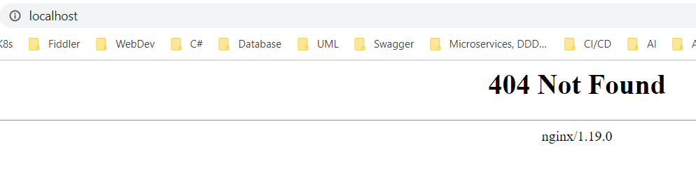

Next we can release a package that uses ingress controller.

```
helm install demoguestbook guestbook
```

After this we have to add entries to *C:\Windows\System32\drivers\etc\hosts*
to have mapping between DNS names and localhost address.

```txt
127.0.0.1 frontend.local
127.0.0.1 backend.local
```

This names are also used in [ingress.yaml](charts/chart4/chart/guestbook/charts/frontend/templates/ingress.yaml).

Finally we can open the UI in web browser:

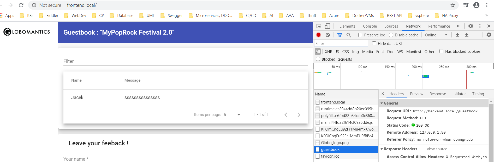


# links
https://app.pluralsight.com/library/courses/kubernetes-packaging-applications-helm/exercise-files   
https://github.com/phcollignon/helm3   
https://www.youtube.com/watch?v=sHUSiM8jqbA (ingress controller installation)
https://github.com/helm/charts